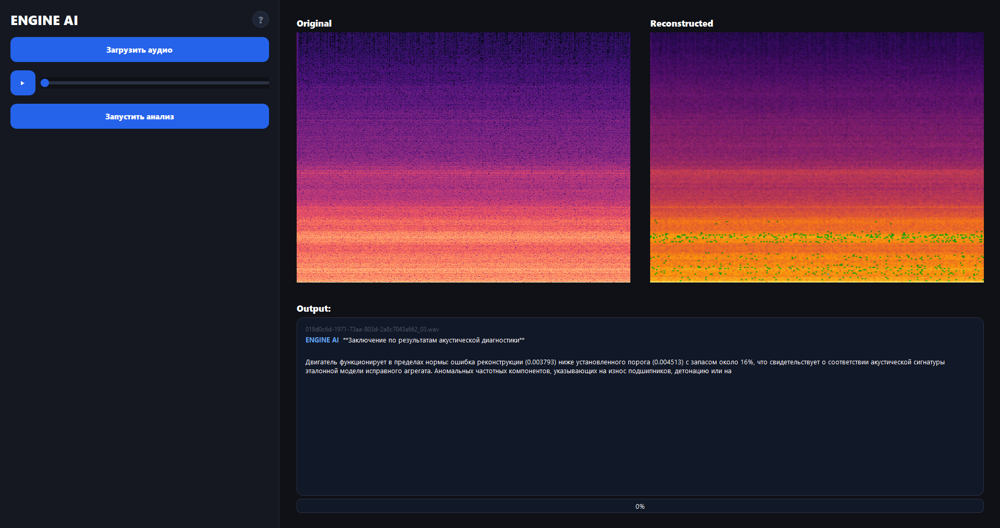
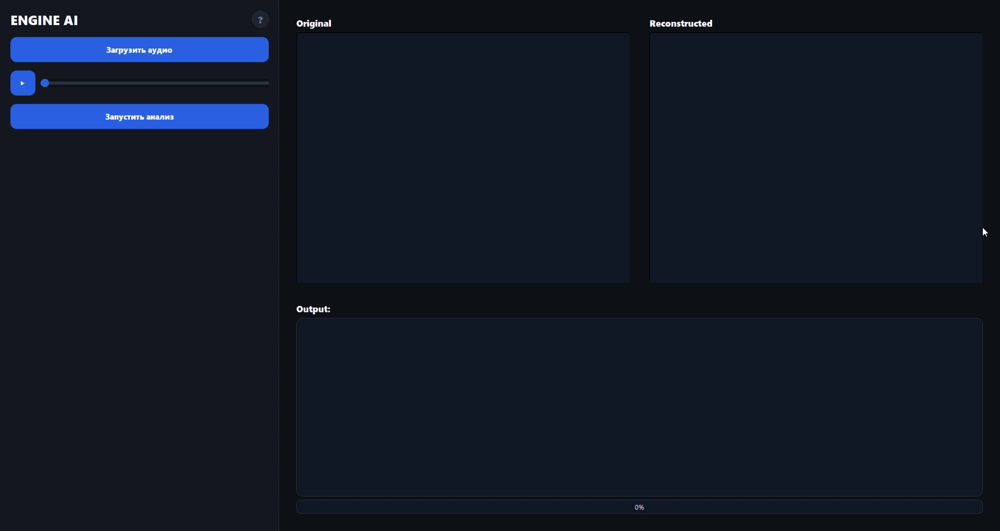

# ENGINE AI — Система диагностики двигателей

Десктопное приложение для анализа звука двигателя и автоматического выявления аномалий с помощью машинного обучения и AI-диагностики.

## Скриншоты





## Как это работает

1. Загружаете WAV-запись звука двигателя
2. Алгоритм PCA анализирует спектрограмму и сравнивает с эталоном нормального звука
3. Если ошибка реконструкции превышает порог — фиксируется аномалия
4. Claude AI выдаёт профессиональное заключение о состоянии двигателя

## Установка

```bash
pip install -r requirements.txt
```

## Запуск

```bash
python app.py
```

## Папка models

В папке `models/` хранится обученная PCA-модель:

- `pca_model.pkl` — обученная модель
- `threshold.npy` — порог ошибки

## API ключ

Для умных ответов EngineAI нужен ключ **Scarlex API** — это сервис-посредник для доступа к модели **Claude Opus** от Anthropic.

Купить ключ можно на сайте: [scarlex.ru](https://scarlex.ru)

После покупки создайте файл `api_key.txt` в папке с программой и вставьте в него ключ.
## Требования к аудиофайлу

- Формат: WAV
- Минимальная длительность: **5 секунд**
- Максимальная длительность: **10 секунд**

Из загруженного файла автоматически выбирается наиболее информативный 5-секундный участок — тот, где энергия звука двигателя максимальна.